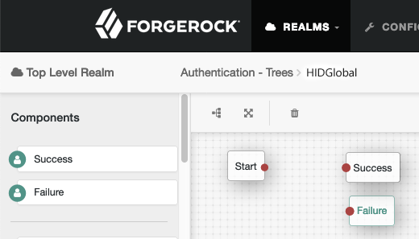
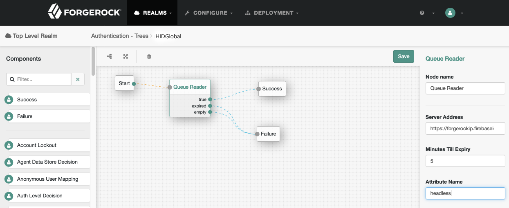
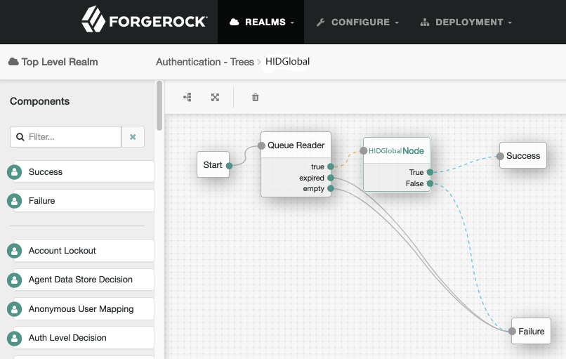
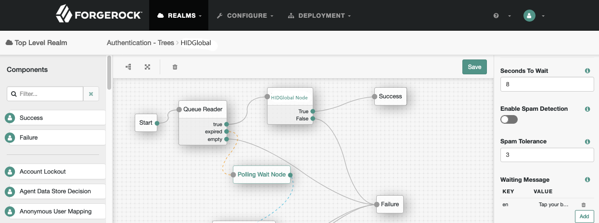
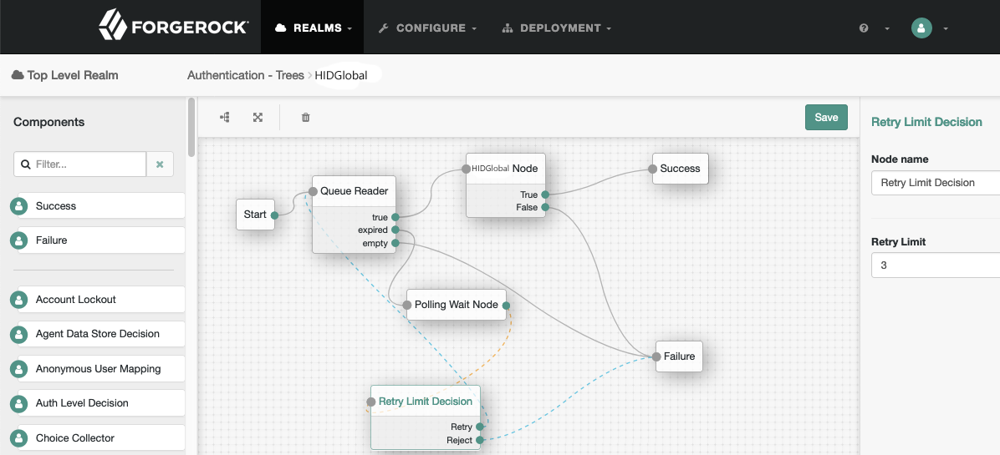
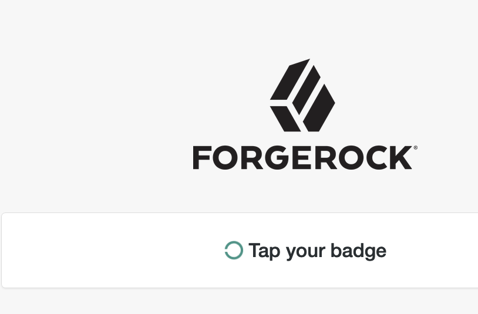
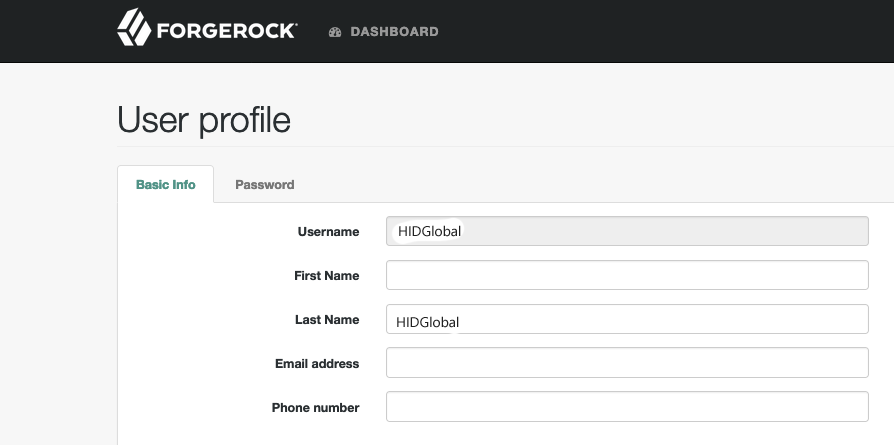

# HID Global Authentication Node

The HID Global Authentication Node allows ForgeRock users to integrate their AM instance with HID Global smart, physical card reader (the below uses as reference the "Omnikey 5x27"); the first part uses a stand-alone java client that updates a ForgeRock named user's record with the value of his/her RF ID smart card; the second part then uses said value as part of this Authentication Tree described here.

This document assumes that you already have:
> 1. an AM 6.5+ instance running with a user base configured
> 2. a HID Global physical card reader
> 3. installed the Queue Reader Node (https://github.com/javaservlets/QueueReader) and set it's Attribute Name to 'headless' 

## Configuration in HID Global

1. On a machine connected to the card reader, navigate to 192.168.63.99 and configure your card reader to send the Card Out Event Keystroke of "[CTRL]M"
 

2. From a command line run the HID Global stand-alone as described in the [java client Read Me](./pojo/readme.md)

## Configuration in ForgeRock

The HID Global Auth node is packaged as a jar file; you can either use the maven build tool ('mvn clean install') from the sources here, or use download the pre-built jar from the releases tab at https://github.com/javaservlets/HID Global/releases/latest.

You then will need to deploy into the ForgeRock Access Management (AM)6.5+ application WEB-INF/lib folder which is running on a tomcat server.

1. In a new browser window login into the AM console as an administrator and go to `Realms > Top Level Real > Authentication > Trees`.

2. Click on the **Add Tree** button. Name the tree HID Global and click **Create**.

3. Add the tree node **Success** to the canvas.

4. Add the tree node **Queue Reader** to the canvas. Fill in the values for a. your message server (note the out of the box value is https://forgerockip.firebaseio.com) b. the number of minutes till the message is expired and c. the value of 'headless'

4. Configure these nodes as shown in this image, and click the **Save** button on the canvas:

5. Add the tree node ** HID Global Node** to the canvas. For Attribute Name, use the value 'sunIdentityMSISDNNumber' if you used the default instructions for the HID Global POJO. Configure these nodes as shown in this image:

6. Add the tree node **Polling Wait Node**. Under the **Waiting Message** attribute, enter 'en' for the key and 'Tap your badge now' for the value and make sure to then click the **+** followed by the **add** button.

13. Add the tree node **Retry Limit Decision** and configure these nodes as shown in this image, and then click **Save**:

## Verification in a browser
1. In a new private browser window navigate to http:(your AM instance name)/openam/XUI/#login&service=HID Global

2. After you follow the next step ("Verification on your card reader"), and tap your badge or smart card against the pcProx reader within the time you configured in step 4.b above, you should see this:

## Verification on your card reader
1. To run the HID Global stand-alone java client see the **Headless** section of the POJO folder at https://github.com/javaservlets/HID Global
